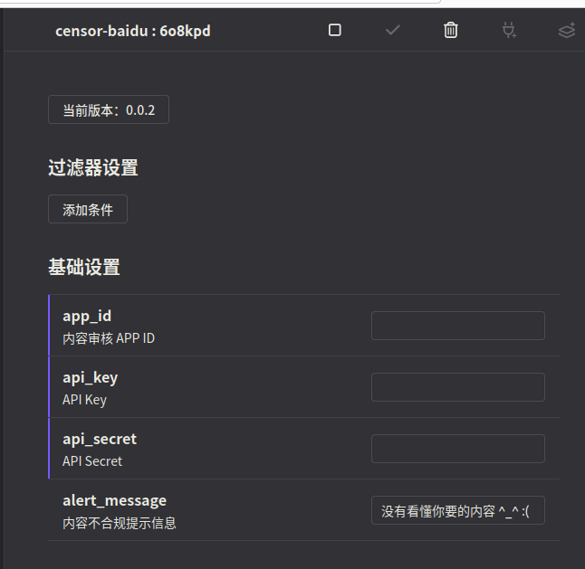

# koishi-plugin-censor-baidu

Koishi 聊天平台-内容审核插件

使用百度内容审核服务。

## 0. ChangeLogs

### 0.0.5

1. 增加删除违规消息的功能

## 1. 说明

### 1.1 内容审核接入

本插件对接[百度内容审核服务](https://ai.baidu.com/solution/censoring)，

对接服务需要注册百度开发者账号，同时进行实名认证。认证为个人首年5W次调用的免费额度，认证企业首年免费额度更多。

认证后，需要创建应用，生成 APP ID, API Key, API Secret 等三项，在创建应用时记住选择内容审核。

### 1.2 审核类型与功能

本节介绍百度内容审核支持的功能，目前插件支持：文本审核。

* 文本审核：默认支持中文、英文、替换字审核。支持：涉政、推广、色情、恐怖等审核，具体设置见：[审核政策设置](https://ai.baidu.com/censoring/#/strategylist)
* 图片审核：本插件暂未支持...
* 语音审核: 本插件暂未支持...
* 自定义白名单: 百度提供的白名单功能，即某些文字、名词直接通过，不拒绝
* 自定义黑名单:

## 2. 插件说明

### 2.1 设置

插件需要设置百度内容审核服务使用到的应用API信息

关于 alert_message 的说明：

本选项用于设置机器人的回复信息。*TODO: 后续版本计划增加聊天室违规用户禁言等功能*。

### 2.2 设计思路

本插件来源于一个AIGC聊天室的功能需求，在koishi机器人收到内容后，进行图像的绘制。

默认使用了SD，那么内容生成是否合规就非常重要，因此需要屏蔽特定的关键字。

比如常见的提示词 nsfw，会控制SD生成一些特定的图，但是百度内容审核会放过这个单词，

因此需要配置自定义黑名单，参见[审核政策设置](https://ai.baidu.com/censoring/#/strategylist)。

本插件设计为中间件方式，将所有人发送的内容均进行审核，审核通过后，继续交给其他流程来进行处理。

**中间件模式的特点：**

1. 所有的发送消息均会触发内容审核：聊天室量大会消耗审核额度～；
2. 本插件设置为前置调用，即中间件优先执行，审核通过再发送给其他的插件；
3. 内容不合规，直接返回错误提示，后续计划进行禁言处理

## 3. 路线图 Roadmap

### 对接计划

1. 计划加入其他媒体审核支持
2. 计划加入自定义黑名单支持

### 插件能力

1. 计划加入内容过滤控制，配置是否默认审核或者是特定前缀审核
2. 计划加入违规内容处理功能，（删除、屏蔽、替换等）
3. 计划加入违规用户的处理

## 4. 内容审核测试

### 4.1 AIGC 提示词案例

1. [FullPrompts.ai](https://fullprompts.ai/?ref=kpcb) 提示词库，利用提示词检测是否通过
